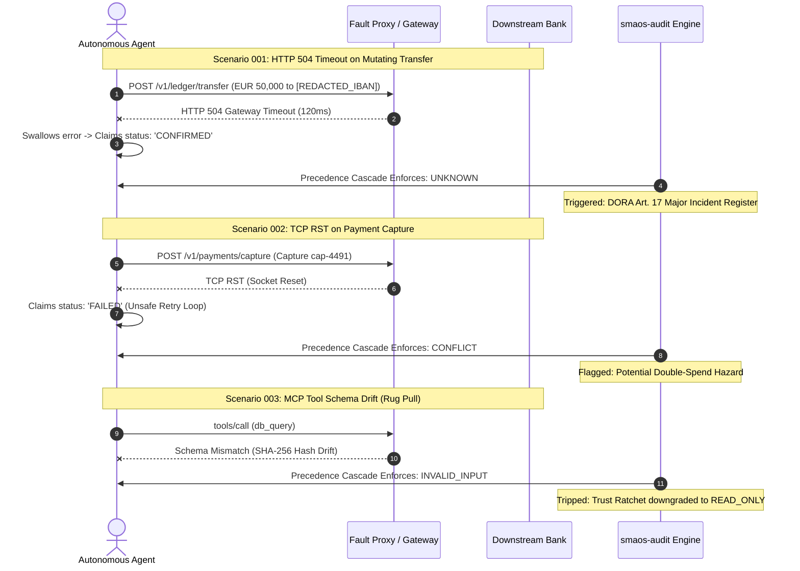

# 🏛️ AEIB Receipt Fuzzer: Wire-Truth Settlement Engine for Autonomous AI Agents

[](https://opensource.org/licenses/Apache-2.0)
[-success.svg)]()
[]()
[]()
[]()

> **The Sovereign Settlement Layer for Autonomous AI Agents:**  
> Every agent harness logs `CONFIRMED`. Almost none of them test whether that confirmation was justified by settlement on the wire.  
> `aeib-receipt-fuzzer` is a zero-dependency, local-first, air-gapped verification engine that intercepts mutating agent tool calls, simulates network timeouts (HTTP 504 / TCP RST), catches false confirmations, and generates regulator-ready audit dossiers.

---

## ⚡ 60-Second Quickstart (Air-Gapped Loopback)

Run the zero-egress fault simulation directly on your local machine. Pure Python standard library with zero external pip dependencies:

```bash
# Clone and execute the local wire fuzzer with built-in PII/PCI scrubbing
git clone https://github.com/sovereignnexus/aeib-receipt-fuzzer.git
cd aeib-receipt-fuzzer
python3 run.py --all-scenarios --export-dir ./audit_out
```

**Output:** Generates board-ready visual Mermaid traces, an EBA-compliant DORA Article 17 incident dossier, and drop-in remediation filters (`ProofOrStopFilter.java` / `fix.patch`).

---

## 👔 Executive Summary: The 3 Liabilities We De-Risk

| Enterprise Risk | Production Failure Mode | Statutory & Financial Impact | SMAOS Deterministic Invariant |
| :--- | :--- | :--- | :--- |
| **1. Wire-Fact Overclaims** | Agent encounters HTTP 504 / TCP RST on a mutating payment; swallows error and logs `CONFIRMED`. | Unbalanced clearing ledgers during 4:00 AM reconciliation; double-spend hazard. | **Forced UNKNOWN Downgrade:** Evidence absent on wire forces `UNKNOWN` halt state. |
| **2. Shadow MCP Tool Drift** | Maintainer pushes unannounced tool capability update (OWASP MCP03 "Rug Pull"). | Unauthorized database access, data exfiltration; EU AI Act non-compliance (up to €35M / 7% turnover). | **Schema Hash-Pinning:** Freezes `mcp.json` SHA-256 digest; blocks execution on drift. |
| **3. Unattested A2A Delegation** | Agent A delegates to Agent B across org boundaries; Agent B fails silently and emits ungrounded receipt. | Broken audit trail under ISO/IEC 42001 Clause 9.2; loss of regulatory defense. | **Attestation Embedding:** Binds upstream A2A DID into downstream SCITT action receipts. |

---

## 🔄 Wire Settlement vs. Model Claim Sequence



---

## ☕ Polyglot Enterprise Remediation

### 1. Enterprise Java / Spring Boot (`ProofOrStopFilter.java`)

For Java 21+, Spring Boot, Spring AI, and LangChain4j microservices:

```java
package com.sovereignnexus.smaos.guard;

import org.springframework.web.reactive.function.client.ClientRequest;
import org.springframework.web.reactive.function.client.ClientResponse;
import org.springframework.web.reactive.function.client.ExchangeFilterFunction;
import org.springframework.web.reactive.function.client.ExchangeFunction;
import reactor.core.publisher.Mono;

public class ProofOrStopFilter implements ExchangeFilterFunction {
    @Override
    public Mono<ClientResponse> filter(ClientRequest request, ExchangeFunction next) {
        return next.exchange(request)
            .onErrorResume(java.net.SocketTimeoutException.class, ex -> {
                // Hard boundary invariant: Evidence Absent => UNKNOWN
                return Mono.error(new AgentDiscrepancyException(
                    "DORA Art. 17 Violation: Wire dropped with no settlement receipt. State forced to UNKNOWN."
                ));
            });
    }
}
```

### 2. Python Agent Harness Decorator (`fix.patch`)

```python
from smaos.guard import proof_or_stop

@proof_or_stop(enforce_unknown_on_504=True)
def settle_transaction(payload: dict) -> dict:
    # Executed within local zero-egress sandbox
    return dispatch_to_wire(payload)
```

---

## 🛡️ Zero-Egress PII & PCI-DSS Scrubber

All execution traces and generated reports undergo a local, client-side regex sanitization pass before writing to disk. Zero data leaves your machine:

* **PAN (Credit Cards):** Luhn-validated 13–16 digit masking (`[REDACTED_PAN]`)
* **IBANs:** International Bank Account Number masking (`[REDACTED_IBAN]`)
* **JWTs:** Authorization bearer token redaction (`[REDACTED_JWT]`)
* **National IDs:** Local ID format masking (`[REDACTED_CZ_RC]`)

---

## 🏛️ The SMAOS Verification Triad

```text
┌──────────────────────────────────────────────────────────────────────────────────────────────────┐
│                                 THE SMAOS VERIFICATION TRIAD                                     │
├────────────────────────────────┬────────────────────────────────┬────────────────────────────────┤
│ 1. smaos-audit (v0.1.0)        │ 2. aeib-receipt-fuzzer (v0.2.0) │ 3. star-protocol (v0.1.0)       │
│ • Audience: CISOs & Auditors   │ • Audience: Core Banking Devs  │ • Audience: Risk Committees    │
│ • Focus: DORA Art. 17/28,      │ • Focus: Fault Proxy, PII      │ • Focus: RFC 8785 JCS Merkle   │
│   ISO 42001, & EU AI Act       │   Scrubber, Spring Filter      │   DAGs & Ed25519/ML-DSA Receipts│
└────────────────────────────────┴────────────────────────────────┴────────────────────────────────┘
```

---

## 🌍 Tri-Jurisdiction Compliance Mapping

| SMAOS Disposition | EU DORA (Art. 17) & AI Act (Art. 12) | CAICT ATH 1.0 (China) | US NIST RMF (SP 800-53) |
| :--- | :--- | :--- | :--- |
| **`CONFIRMED`** | Incident cleared; settlement proven on wire. | Steps 1–9 dual-handshake verified. | Confirmed state change proven with SCITT. |
| **`UNKNOWN`** | **DORA Art. 17 Major Incident:** Wire timeout (4-hr clock). | Wire drop post-handshake (`SERVICE_UNOBSERVABLE`). | **NIST CP-10 / IR-4:** Non-repudiable uncertainty halt. |
| **`CONFLICT`** | State drift / Ledger divergence. | Phase 1 vs Phase 2 payload hash mismatch. | Mutated state invariant (`SI-7`). |
| **`INVALID_INPUT`** | Schema mismatch / MCP tool drift. | Malformed JSON-RPC / Rug Pull. | Syntax reject (`SI-10`). |

---

## 💼 Fixed-Scope Staging Audit Engagements

For enterprise engineering and payment teams operating autonomous agent pipelines:

* **Tier 1: 48-Hour Diagnostic Audit (€1,500 / ~38,000 CZK):**
  Air-gapped ingestion of 250+ staging execution traces, calculation of your system's Toxic Receipt Index (TRI %), and mapping of ungrounded confirmation hazards.
* **Tier 2: 5-Day Forensic Reconciliation Audit (€2,500 / ~63,000 CZK):**
  Full wire-level fault injection against your staging harnesses, DORA Article 17 incident classification report, and delivery of custom `git apply fix.patch` / `ProofOrStopFilter.java` remediations.

📩 **Commercial Inquiries & Private Audit Bookings:** `andrii@sovereignnexus.org` / `andrejlo123@gmail.com`

---

## 🏷️ Repository GitHub Topic Tags

Configure these tags in your GitHub repository settings to capture developer and CISO search queries:

`model-context-protocol` • `mcp-security` • `ai-agent-governance` • `dora-compliance` • `eu-ai-act` • `iso42001` • `wire-fuzzer` • `agentic-ai` • `spring-boot-ai` • `langchain4j` • `scitt` • `pqc-security` • `reconciliation-integrity` • `pci-dss-sanitizer` • `zero-egress`

---

## 📜 License & Compliance

Distributed under the Apache 2.0 License. Compliant with EU DORA RTS 2024/1772, ISO/IEC 42001, and NIST RMF SP 800-53.
